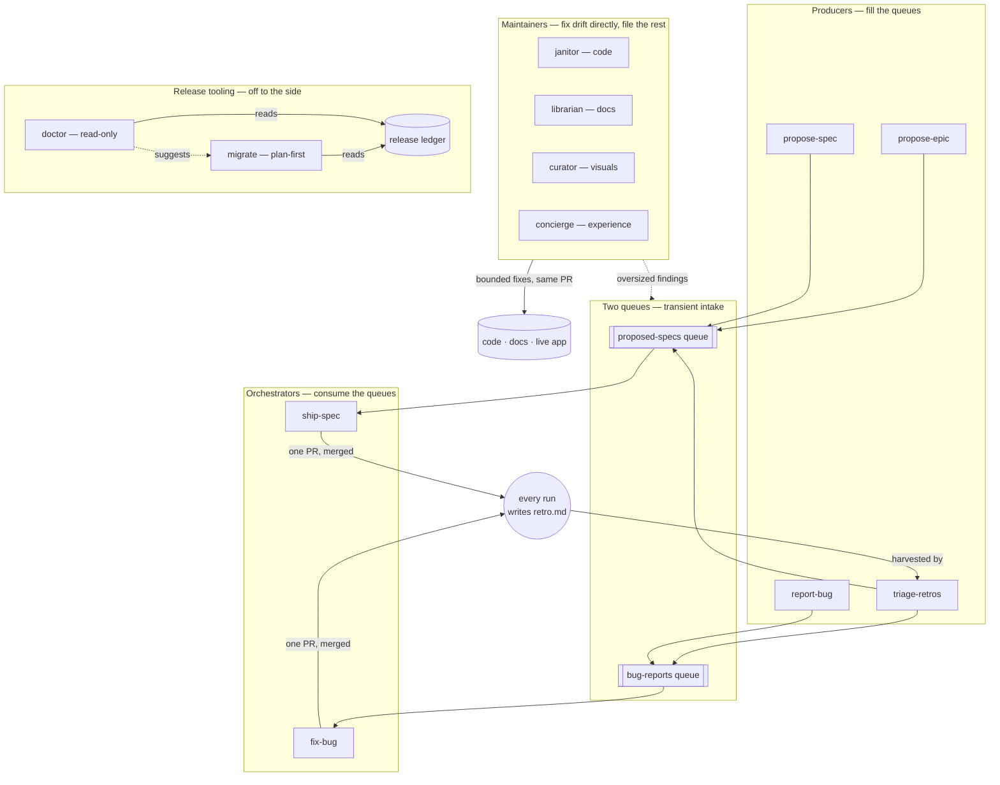
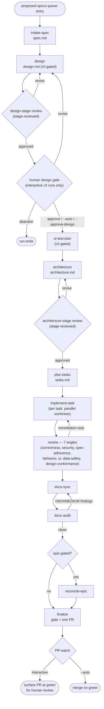
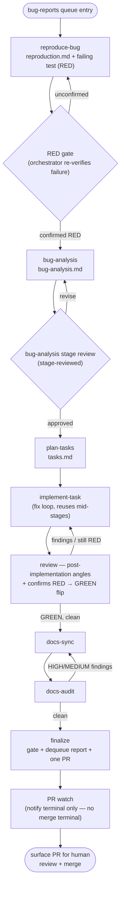
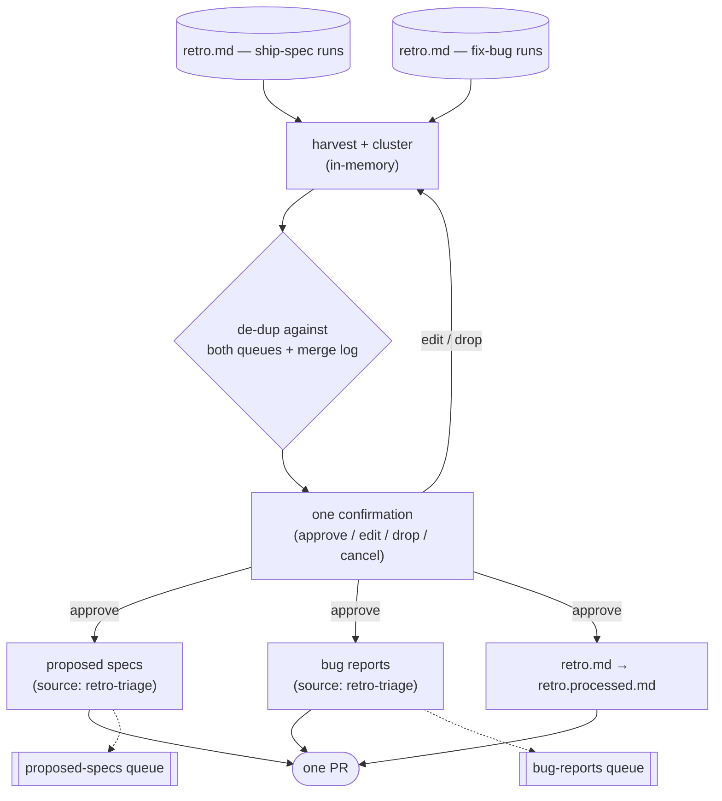

# Materia

> *Prima materia* — the formless base substance the alchemists believed
> everything could be transmuted from. Also: a small glowing orb you slot into
> your equipment to gain skills.

Materia is a Claude Code development-harness **plugin**, distributed via a
plugin marketplace and installed into any repo — nothing to clone, nothing
to fork. Install it once, run `/materia:init`, and it materializes a full
spec-to-ship pipeline tailored to your tech stack:

- **Two queues** — a proposed-specs queue and a bug-reports queue, each a
  transient intake surface with a strict frontmatter/filename contract.
- **Two orchestrators** — `/materia:ship-spec` drives a proposal through intake →
  design (stage-reviewed, then a human gate on interactive UI runs) →
  architecture (stage-reviewed) → tasks → implementation → multi-angle review →
  docs → one PR; `/materia:fix-bug` drives a bug report through a RED-first TDD
  loop that reuses the same mid-stages.
- **Producers** — skills that fill the queues from every signal source you
  have: your ideas (`/materia:propose-spec`, `/materia:propose-epic`), your own
  eyes (`/materia:report-bug`), and the pipeline's own retrospectives
  (`/materia:triage-retros`).
- **Maintainers** — `/materia:janitor` sweeps the code against your standards
  docs, `/materia:librarian` sweeps the docs against the code, and the UI
  maintainers `/materia:curator` (visuals) and `/materia:concierge`
  (experience) sweep the running app — all four fix bounded drift directly and
  file anything oversized straight into the queues as reviewable proposals or
  bug reports, in the same PR.
- **A retro-triage loop that feeds your backlog, not the harness.** Every
  pipeline run writes a `retro.md`; `/materia:triage-retros` clusters the
  accumulated signal and authors it directly into **your project's** backlog —
  proposed specs and bug reports (`source: retro-triage`) — in one PR. The
  pipeline itself ships as a versioned plugin and does not rewrite its own
  skills.
- **A docs system built for agent context** — a progressive-disclosure read
  order (`CLAUDE.md` → `.materia/docs/README.md` → standards + resources → code),
  present-state-only authoring rules, and a deterministic `check:docs` gate
  that keeps it all true.

The glue is **`MATERIA.md`** — a companion document to `CLAUDE.md` that holds
everything stack-specific in named sections (§ Gate, § Eyes, § Surface gates,
§ Environment preflight, …). The pipeline skills are stack-agnostic and
reference `MATERIA.md` by section, so the same battle-tested skill text drives
a Nuxt app, a Rails app, or a CLI tool — only the companion doc changes. Every
PR any skill opens closes with the Materia **sigil** — one line of attribution
naming the skill that cast it, and a promise the harness actually keeps:
*every run feeds the backlog*.

## Install & first run

```
/plugin marketplace add stoodder/materia
/plugin install materia@materia
/materia:init            # scaffolds MATERIA.md + CLAUDE.md + .materia/docs/ into this repo
```

1. **Add the marketplace, then install the plugin** (the two commands above).
   Claude Code resolves `materia@materia` — plugin `materia` from marketplace
   `materia` — and installs the skills into its plugin cache.
2. **Run `/materia:init`** in the target repo. It interviews you about what
   you're building, helps you pick a stack, then writes `MATERIA.md`,
   `CLAUDE.md`, and the `.materia/docs/` skeleton into place — sections your stack
   doesn't need (no UI → § UI-affecting: none) are marked `none` and the
   corresponding skills self-gate at runtime instead of being pruned. Materia
   reserves `.materia/` (plus `MATERIA.md`/`CLAUDE.md` at the root) in the target repo;
   it adopts cleanly where that path is free, and leaves any pre-existing root
   `docs/` alone — that stays yours.
3. `/materia:init` finishes by seeding `.materia/docs/specs/_proposed/` with a
   **bootstrap epic**: the scaffolding of your app skeleton, CI, and gates as
   the pipeline's own first specs. Run `/materia:ship-spec` and the harness
   builds your app from commit one.
4. **Protect `main`** (Settings → Branches, or
   `gh api` — require a pull request before merging). The allowlist
   `/materia:init` seeds into `.claude/settings.json`
   denies the force-push/push-to-main spellings it can express, but prefix
   matching has real limits (trailing flags, refspec forms like
   `git push origin +main` or `HEAD:main` evade it); branch protection is
   the mechanical backstop that
   makes "every change lands via PR" true regardless of what an agent types.
   With required approvals enabled, `--auto` autopilot merges wait for your
   approval instead of completing on green — both behaviors are correct.

**Forge support is GitHub-only.** Materia's automated forge operations — opening
PRs, reading CI, merging — drive **GitHub** through the `gh` CLI (or its GitHub
MCP twins in a `gh`-less environment). On any other forge (GitLab, Bitbucket,
Gitea, …) set `MATERIA.md` § Forge to `none`: the spec-to-ship pipeline still
runs end to end, but the PR/CI/merge steps degrade to the manual `none`
convention — the skill prints the drafted PR and stops for you to open and merge.

Once initialized, the pipeline runs entirely through slash commands —
`/materia:ship-spec`, `/materia:fix-bug`, the producers, the maintainers, and
`/materia:triage-retros` — with no per-repo skill files to keep in sync;
upgrading the plugin upgrades every repo it's installed in.

## How it flows

Everything below runs from the two queues outward. Producers fill them;
`ship-spec` and `fix-bug` drain them into merged PRs; maintainers sweep the
repo and the running app directly, filing anything too large back into the
same queues; every run's retrospective closes the loop through
`triage-retros`; and `doctor`/`migrate` sit off to the side, reading the
release ledger to keep an installed repo's artifacts current.



A few things this map is worth stating in words, not just arrows:

- **`triage-retros` writes to both queues in one run.** It is the only
  producer with two outputs — product signal becomes proposed specs, defect
  signal becomes bug reports — both stamped `source: retro-triage`.
- **Maintainers are not producers, but they can act like one.** A janitor,
  librarian, curator, or concierge sweep fixes what fits in its own PR and
  files anything too large as a *new* queue entry in that same PR — the
  librarian's carve-out is proposed specs only; the other three may use
  either queue. See
  [`standards/skills.md` § Maintainer lifecycle](plugins/materia/scaffold/.materia/docs/standards/skills.md#maintainer-lifecycle--the-shared-contract).
- **`ui-inspection` no longer exists.** The live-app sweep is now two
  maintainers — `curator` for visual-standards drift, `concierge` for
  flow/interaction/a11y drift — both driving the same Eyes toolchain against
  the running app and both ending at a PR (see
  [§ Key concepts](#key-concepts--terminology) below).

## The three flows, up close

### `ship-spec` — proposal to merged PR



Design and architecture are each **stage-reviewed** by fresh-context
reviewers before the pipeline moves on — the human design gate is a separate,
later checkpoint that only interactive UI runs pause at (`--auto` and
`--approve-design` runs skip the pause, never the review). After `finalize`
opens the PR, **every** run watches it to green, fixing CI and resolving merge
conflicts; an interactive run stops there for your review, and an `--auto` run
additionally merges.

### `fix-bug` — bug report to merged fix, RED first



`fix-bug` never trusts a subagent's word that the reproduction is failing —
the orchestrator independently re-runs it before advancing past the RED gate.
It reuses `plan-tasks`, `implement-task`, `review`, `docs-sync`, and
`docs-audit` verbatim from the ship-spec pipeline, swapping `bug-analysis.md`
in for `architecture.md` as the planning input. Its PR watch has **no merge
terminal at all** — win or lose the autopilot flag, a `fix-bug` PR always
stops at "surfaced for review," never auto-merges.

### `triage-retros` — closing the loop



Every `ship-spec`/`fix-bug` run leaves a `retro.md` behind. `triage-retros` is
run by hand, on your schedule, after a stretch of pipeline activity — it never
touches the pipeline's own skills, only your project's backlog. Product signal
becomes proposed specs; defect signal becomes bug reports; both land in one PR
against your queues, and every consumed retro is renamed to
`retro.processed.md` in the same commit.

## Key concepts & terminology

| Term | Meaning | Detail |
|---|---|---|
| **Queue** | A transient intake surface — proposed specs or bug reports — with a strict frontmatter/filename contract; files land at the top level and are removed once consumed. | [`specs/_proposed/README.md`](plugins/materia/scaffold/.materia/docs/specs/_proposed/README.md) |
| **Producer** | A skill that authors queue entries under a registered `source:` key — `propose-spec`, `propose-epic`, `report-bug`, `triage-retros`. | [`standards/skills.md` § Skill kinds](plugins/materia/scaffold/.materia/docs/standards/skills.md#skill-kinds) |
| **Orchestrator** | A skill that consumes one queue entry and drives it, stage by stage, to exactly one merged PR — `ship-spec`, `fix-bug`. | [`specs/README.md`](plugins/materia/scaffold/.materia/docs/specs/README.md) |
| **Maintainer** | A skill that sweeps the repo or the running app for drift against your standards, fixes what's bounded directly, and files anything oversized as a queue entry in the same PR — `janitor` (code), `librarian` (docs), `curator` (visuals), `concierge` (experience). | [`standards/skills.md` § Maintainer lifecycle](plugins/materia/scaffold/.materia/docs/standards/skills.md#maintainer-lifecycle--the-shared-contract) |
| **The sigil** | The Materia attribution footer — 🔮 `Forged with [Materia] · cast by <skill> · base matter → gold, every run feeds the backlog` — that closes every PR any skill opens, always last. | [`standards/skills.md` § PR attribution](plugins/materia/scaffold/.materia/docs/standards/skills.md#pr-attribution--the-materia-sigil) |
| **`MATERIA.md`** | The companion doc to `CLAUDE.md` holding every stack-specific section (§ Gate, § Eyes, § Surface gates, § Skill routing, …) that the stack-agnostic skills reference by name. | [`plugins/materia/scaffold/MATERIA.md`](plugins/materia/scaffold/MATERIA.md) |
| **The gate** | `MATERIA.md` § Gate — the full local check (lint, typecheck, tests, `check:docs`) that every `finalize` run and every maintainer sweep must pass before opening its PR. | `MATERIA.md` § Gate |
| **Eyes** | `MATERIA.md` § Eyes — the browser/capture toolchain that drives the live app and takes canonical-viewport screenshots, used by UI-gated review angles and the UI maintainers. | `MATERIA.md` § Eyes |
| **Surface map** | `.materia/docs/surface-map.md` — the canonical, ordered list of pages (or CLI commands) a UI maintainer or design-conformance check must drive. | `.materia/docs/surface-map.md` |
| **Retro** | `retro.md` — the per-run retrospective every `ship-spec`/`fix-bug` run appends to, one entry per stage; harvested by `triage-retros` and then renamed `retro.processed.md`. | [`specs/README.md` § Resumable, run by subagents](plugins/materia/scaffold/.materia/docs/specs/README.md#resumable-run-by-subagents) |
| **Epic** | A multi-spec initiative under `.materia/docs/epics/`, decomposed into member proposals wired by a `depends_on` graph and kept in sync by `reconcile-epic` as members ship. | [`epics/README.md`](plugins/materia/scaffold/.materia/docs/epics/README.md) |
| **Artifact schema vs. plugin semver** | Independent axes: `pluginVersion` is the plugin's semver (bumps on every release); `artifactSchema` is an integer tracking the installed-artifact contract (bumps only when that contract itself changes). | [`release/README.md`](plugins/materia/release/README.md) |
| **Release ledger** | The machine-readable `plugins/materia/release/` tree — the source of truth `doctor`/`migrate` read; changelog prose summarizes it but never overrides it. | [`release/README.md`](plugins/materia/release/README.md) |
| **`doctor` / `migrate`** | The read-only health check vs. the explicit, plan-first upgrade command for an installed repo — see § Staying current below. | § Staying current |
| **Scaffold** | `plugins/materia/scaffold/` — the templates (`MATERIA.md`, `CLAUDE.md`, `.materia/docs/…`) that `/materia:init` materializes into a user repo; not this repo's own configuration. | [`CLAUDE.md`](CLAUDE.md) |

## Repo layout

```
.claude-plugin/marketplace.json      the marketplace catalog (one entry: materia)
plugins/materia/
  .claude-plugin/plugin.json         the plugin manifest
  skills/                            the pipeline skills (stack-agnostic), invoked /materia:<name>
  scaffold/                          the bundled MATERIA.md/CLAUDE.md/docs templates
                                      and .materia/ (the check-docs.sh docs gate, review-angles
                                      library + project.json) that /materia:init materializes into your repo
  release/                           the plugin's own release/migration ledger (semver +
                                      artifact-schema contract; not materialized into repos)
scripts/validate-plugin.mjs          validates the marketplace + plugin manifests and the scaffold
```

## Staying current — doctor, migrate & the release ledger

Materia is a versioned plugin, so a repo it's installed in can drift from what the
current plugin expects. Two operator commands make that legible — and both are
**opt-in and non-surprising**:

- **`/materia:doctor`** — a **read-only** health check. It reads the plugin's release
  ledger and your repo's `.materia/project.json` and reports one status
  (`healthy · warnings · action-needed · blocked · unknown`), your current vs latest
  artifact schema, and any changes to adopt. It **writes nothing** and migrates
  nothing — where a migration would help it only *suggests* `/materia:migrate --plan`.
- **`/materia:migrate`** — the explicit, **plan-first** upgrade command. The default
  (`--plan`) prints what it *would* do and changes nothing; only `--apply` acts, and
  only for safe, idempotent migrations. **Migrations never auto-run** — nothing
  triggers them from plugin update or startup. Upgrading the plugin never silently
  rewrites your repo; you run migrate when you choose to.

**The release ledger is the source of truth.** Compatibility is defined by a
machine-readable release/migration ledger (`plugins/materia/release/`), not by prose.
Human changelogs and release notes *summarize* the ledger for people; they do **not**
define compatibility — when they disagree, the ledger governs. It is what doctor and
migrate actually read (from the installed plugin cache; the ledger is never copied into
your repo).

**Plugin version ≠ artifact schema.** The plugin's semver changes whenever it ships; the
**artifact schema** — an integer tracking the **installed-artifact contract** — the canonical
set of installed artifacts, their canonical locations, and the `.materia/project.json`
shape — changes only when that contract actually changes, so a plugin upgrade does **not**
imply a project migration. `0.1.0` is the pre-tracking baseline (schema 1); the first
tracked schema (2) begins with this compatibility system itself; schema 3 moved the
check:docs gate script to its canonical `.materia/scripts/` home; schema 4 relocates the
whole agent-facing docs tree from the repo-root `docs/` to `.materia/docs/`, so it can
never collide with a repo's own human-facing `docs/`. See
[`plugins/materia/release/README.md`](plugins/materia/release/README.md) for the normative
definition — the full schema/semver contract and the impact classifications (`none` through
`breaking`) doctor and migrate act on.

**Project state — new vs existing repos.** New repos get their state for free:
`/materia:init` materializes `.materia/project.json` at the current schema from the
bundled scaffold, so a fresh install is born tracked. An existing repo behind the current
schema — untracked-legacy, or tracked but stale — is detected by `/materia:doctor`, which
points at `/materia:migrate --plan`; `/materia:migrate --apply` then runs whichever v0
migrations apply to it (initializing project state, relocating the check:docs gate script,
relocating the docs tree) and stamps the adopted schema.

This is a deliberately **conservative, dogfood-grade v0 foundation**, not a public-grade
migration framework: a small, growing set of automated migrations, plan-first, no auto-run,
and it refuses to touch a malformed or hand-authored stale state file — those are surfaced
as manual items, never overwritten.

## Design values

- **Contracts are sacred.** The queue frontmatter contracts, the producer
  lifecycle, the shared maintainer lifecycle, the RED-before-fix gate, the
  sole-writer retro rule — these were hardened over many runs and ship
  verbatim. `/materia:init` fills slots; it does not redraft contracts.
- **One home per fact.** Stack specifics live in `MATERIA.md` and the
  generated `.materia/docs/standards/*`; skills point at them instead of restating.
- **The PR is the review gate.** Every repo-changing pipeline run ends at
  exactly one PR — the named exceptions are the read-only/operator tools
  (`/materia:doctor`, which writes nothing; `/materia:migrate --apply`, which
  writes the working tree directly with no PR), `/materia:init`'s bootstrap
  commit to the default branch, and a pipeline's internal sub-stages (which
  don't each open their own PR). Nothing auto-merges except an explicit
  `--auto` autopilot run and the librarian's mechanically docs-only diff —
  and even the librarian forfeits that privilege the moment a sweep touches
  `MATERIA.md`, crosses its scale guard, or files a queue entry; every other
  maintainer stops at a green PR for you to review.
- **The harness is a versioned plugin, not a self-editing one.** Every repo
  it's installed in runs the same skills from the same plugin cache; there is
  no per-repo fork to diverge. What *is* yours is the signal: retros feed
  your project's specs/bugs backlog, and `MATERIA.md`'s stack-specific
  sections are where your repo's own configuration lives.

## Provenance

Extracted and generalized from a production Claude Code pipeline that
shipped 60+ specs end-to-end. The contracts here are as-built, not
speculative.
