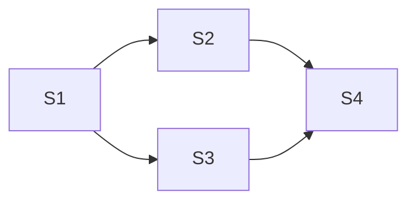

# Epics — multi-spec initiatives

An **epic** is a feature-set too big for one spec: a coherent product
initiative that decomposes into several single-shippable-unit specs with an
explicit dependency graph between them. This tree sits beside
[`docs/specs/`](../specs/README.md) and [`docs/bugs/`](../bugs/README.md)
because an epic is the parent concept — it feeds the spec queue rather than
living inside it. It is the **permanent record** of those initiatives —
unlike the transient queue at
[`../specs/_proposed/`](../specs/_proposed/README.md), epic folders are never
removed; they carry the initiative's vision, research, decomposition, and
change history for the life of the repo.

This document defines the contract. [`materia-propose-epic`](../../.claude/skills/materia-propose-epic/SKILL.md)
creates epic folders; [`materia-reconcile-epic`](../../.claude/skills/materia-reconcile-epic/SKILL.md)
maintains them as member specs ship. Anything else reads but does not write.

## What lives here

One folder per epic, named with the same `<yyyy-mm-dd-hhmmss>-<rand>-<slug>` triad
used by spec folders, improvement folders, and proposal filenames:

```
docs/epics/
  README.md                            ← this file (the contract)
  <yyyy-mm-dd-hhmmss>-<rand>-<slug>/
    epic.md                            ← the epic document (format below)
    research.md                        ← synthesized research brief + sources
```

`epic.md` is the source of truth for the initiative; `research.md` is the
durable provenance for the web-research pass that shaped it (findings,
recommendations, and source URLs, so a later reader can judge whether the
research has gone stale). `research.md` follows the citation conventions of
[`docs/research/README.md`](../research/README.md) § Authoring a note —
primary sources over listicles, bare URLs or `<url>` over markdown links (so
the doc link-check stays focused on in-repo paths) — but stays co-located
here because its lifecycle is the epic's, not the standing corpus's.

## `epic.md` format

### Frontmatter

```yaml
---
id: <fresh 6-char base36 token>        # same shape + minting command as proposal ids
schema_version: 1
title: <one-line title>                # matches the body's H1
date: <YYYY-MM-DD>                     # the date the epic was created
status: active                         # active | shipped | abandoned
---
```

- **`id`** — the epic's canonical identity; member proposals point back at it
  via their `epic:` frontmatter key. Minted with
  `LC_ALL=C tr -dc 'a-z0-9' </dev/urandom | head -c 6`; immutable once issued.
- **`status`** — `active` while any member spec is unshipped; `shipped` when
  every member reached a terminal state (shipped or dropped) with at least one
  shipped; `abandoned` when the operator retires the epic (its pending member
  proposals are deleted from `docs/specs/_proposed/` in the same change).

### Body

````markdown
# <Title> — epic

> One sentence: the initiative and the user outcome it unlocks.

## Vision

<What the app looks like when this epic is done — the narrative arc across
all member specs, written so a member spec's intake can borrow context.>

## Problem

## Goals

## Non-goals

## Research summary

<The load-bearing findings from research.md, in a few bullets, each with its
source as a bare URL. Full brief + sources: [research.md](research.md).>

## Member specs

| # | Proposal id | Title | Depends on | Status | Shipped as |
|---|---|---|---|---|---|
| S1 | <id> | <title> | — | proposed | — |
| S2 | <id> | <title> | S1 | proposed | — |

<Status vocabulary: `proposed` (in the queue) · `in-flight` (a ship-spec run
claimed it) · `shipped` (member PR merged) · `dropped` (retired without
shipping). "Shipped as" holds the `docs/specs/<dated-slug>/` folder path once
one exists.>

## Dependency graph



**Ship order:** <the topological reading — which members are ready now, which
unlock next, which can run in parallel. e.g. "S1 first; S2 + S3 in parallel
once S1 merges; S4 last.">

## Decisions

<Numbered log of the calls made during brainstorming + research — each entry
one line of decision plus one line of why. reconcile-epic revises entries
here when shipped reality overturns one, marking the old text ~~struck~~
rather than deleting it.>

1. **D1 — <decision>.** <why>

## Change log

<Appended by reconcile-epic, one entry per reconciliation run — newest last.>

- <YYYY-MM-DD> — <what changed in the epic and which pending members were
  cascaded, one line per run>
````

Every H2 above is required, in that order — `materia-propose-epic` emits them all and
`materia-reconcile-epic` relies on `## Member specs`, `## Decisions`, and
`## Change log` being present to parse and append.

## Epic ↔ member linkage (bi-directional)

The linkage is written from **both sides** so either artifact alone can find
the other:

- **Epic → members:** the `## Member specs` table carries each member's
  proposal `id` (identity while queued) and its `Shipped as` spec-folder path
  (identity after shipping).
- **Member → epic + siblings, while queued (frontmatter):** each member
  proposal in `docs/specs/_proposed/` carries two extra frontmatter keys on top of the
  queue contract — allowed because that contract treats unknown fields as
  informational:

  ```yaml
  epic: <epic-id>
  depends_on: []            # or [<sibling proposal id>, …]
  ```

- **Member → epic + siblings, forever (body):** each member proposal ends
  with an `## Epic context` body section naming the epic folder path, what
  the member builds on, and which siblings depend on it. Because
  `materia-intake-spec` adopts a structured proposal body **verbatim** (and the
  frontmatter is stripped at intake), this section is what survives into the
  shipped `docs/specs/<dated-slug>/spec.md` — the durable spec-side backlink.

Sibling-to-sibling relationships are derivable from either side: two members'
`depends_on` chains, or the epic's table + graph.

## Lifecycle

1. `/materia-propose-epic` runs brainstorm + research with the operator, then lands
   the epic folder **and** its member proposals (in `docs/specs/_proposed/`, with
   `source: epic`) in one PR.
2. The operator ships members with `/materia-ship-spec <member-id>`, respecting the
   epic's ship order (nothing enforces it — the graph is the guide).
3. `materia-ship-spec` reconciles automatically: the member proposal's `epic:` key
   sets the **epic gate** (`materia-ship-spec/SKILL.md` § Epic gate), which spawns
   `materia-reconcile-epic` in pipeline mode between docs-audit and finalize — the
   epic sync (statuses, decisions, change log) and the cascade edits into
   the **pending** member proposals still in the queue ride the member's own
   PR, so merging the member and syncing the epic are one atomic event.
4. Standalone `/materia-reconcile-epic <epic-id>` is the **backstop and status
   board**: run it when drift arrived outside the pipeline (manual changes,
   a `materia-fix-bug` run on epic ground, a run whose epic gate failed and
   degraded), to retire members or the epic, or just to see what's
   unblocked.
5. When the last member reaches a terminal state, `materia-reconcile-epic` flips the
   epic's `status` to `shipped`. The folder stays put — this tree is an
   archive, not a queue.

Steps 2–3 repeat per member; `materia-reconcile-epic` is idempotent and exits clean
when nothing shipped since the last run, so running it "too often" is safe.

## Who writes what

| Writer | May write |
|---|---|
| `materia-propose-epic` | New epic folders; new member proposals in `docs/specs/_proposed/` (`source: epic`) |
| `materia-reconcile-epic` | Existing `epic.md` files; **pending** member proposals of its own epic (body + `depends_on` only — never `id`, `date`, or the filename) |
| everything else | nothing — read-only |

`materia-reconcile-epic` editing queued proposals is the sanctioned exception to the
`docs/specs/_proposed/` rule that producers don't touch other producers' files: the two
skills are one producer family and the epic's `## Member specs` table is the
shared ownership record. It never touches proposals whose `epic:` key names a
different epic (or is absent).
